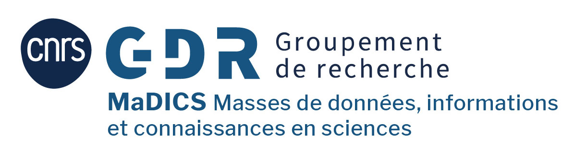
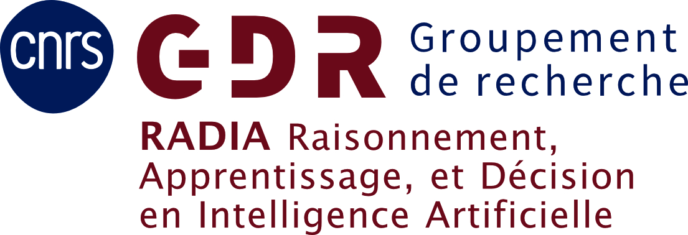

# Neurosymbolic Methods and Their Applications in Data Science

## Journée CNRS *Neurosymbolic Methods and Their Applications in Data Science*  

**6 octobre 2026, Grenoble**

Dans le cadre du workshop *Neurosymbolic Methods and Their Applications in Data Science*, les GDR CNRS MaDICS et RADIA, à travers leur GT commun RECAST, organisent une journée de conférences consacrée aux méthodes neuro-symboliques et à leurs applications en science des données.

Ouverte à l'ensemble des chercheurs, enseignants-chercheurs, doctorants et étudiants, cette journée sera l'occasion de découvrir les avancées récentes dans ce domaine et d'échanger avec des spécialistes de renommée internationale.

## Informations pratiques

**Date :** Mardi 6 octobre 2026 de 9h à 17h

**Lieu :**

    Amphithéâtre du bâtiment IMAG
    Campus universitaire de Grenoble
    150 place du Torrent
    38400 Saint-Martin-d'Hères, France

## Programme

Le programme proposera quatre conférences invitées (keynotes), une table ronde et une session de posters:

[Programme provisoire](program.md)

Le programme détaillé de la journée sera prochainement disponible.

Intervenants confirmés :

* Floris Geerts (Université d'Anvers, Belgique) : Relational Neural Networks
* Thomas Schiex (INRAE, France): A neuro-symbolic architecture learns how to solve NP-hard puzzles: from logical games and discrete optimization to molecular design
* Mehwish Alam (Télécom Paris, France) : Language Models and Symbolic AI
* Giuseppe Marra (KU Leuven, Belgique) : à préciser

## Participation et inscription

La journée est ouverte aux chercheurs et étudiants intéressés par l’**intelligence artificielle**, la **science des données** et les **approches neuro-symboliques**. La participation est **gratuite**, mais **l’inscription est obligatoire**.

[**Formulaire d'inscription**](https://forms.gle/XdKnMxs2F6oKtorj6)

Soumission de posters : 

Les participants souhaitant présenter un poster sont invités à cocher la case correspondante lors de leur inscription en ligne. Ils seront contactés ultérieurement pour les détails pratiques concernant la soumission.

## Organisation

Cette journée est organisée dans le cadre des activités des **GDR CNRS [MaDICS](https://www.madics.fr/)** et **[RADIA](https://gdr-radia.cnrs.fr/)** et de leur GT commun **[RECAST](https://gt-recast.github.io/)**.
